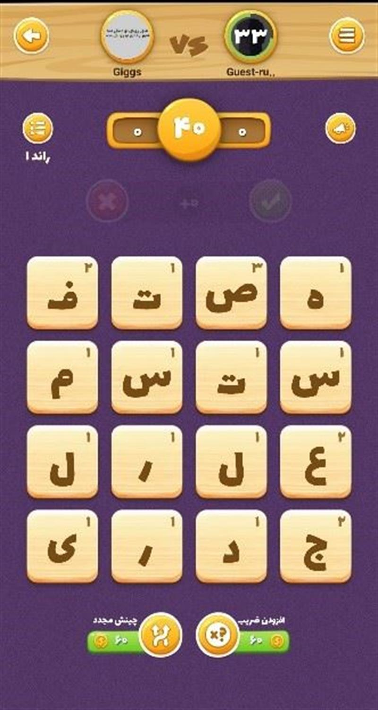

**Bazambazi Word Finder Library**

A package used for cheating the **Letter Mash** game in **[Bazambazi](https://bazambazi.games)**

**Note:**

- **`Version 1.x.x`: Automatic Module (used for all JDKs - `Java 8+`)**
- **`Version 2.x.x`: Explicit Module (used for `JDK 9+` - supports `JPMS`)**



# Features

- **Java Version: `21+`**
- **Project Management Tool: `Maven`**
- **`DFS` (Depth-First Search) Algorithm and `Trie` Data Structure**
- **Unit test**

# Download

**[Maven Central Repository](https://central.sonatype.com/artifact/io.github.backendbaz/bazambazi-wordfinder/overview)**

## `Version 1.0.0`

- Automatic Module
- Basic search logic (`DFS` and `Trie`)
- 32520 words

## `Version 1.1.0`

- Unit testing
- added 2 words

## `Version 2.0.0`

- Explicit Module
- improved project structure (models)

## `Version 2.1.0`

- added filtering of words based on high-scoring letters (**`ضریب`**)

## `Version 2.1.1`

- added a word (`کفاشیان`)
- calculates and returns number of cells in grid

## `Version 2.1.2`

- added 12 words
  - `اطلاعی`
  - `بخشم`
  - `سخنی`
  - `نیشن`
  - `پش`
  - `حس`
  - `ریف`
  - `صرب`
  - `پژ`
  - `خیشومی`
  - `گشایی`
  - `ژان`

## `Version 2.1.3`

- Added 8 words:
  - `قلتک`
  - `شهین`
  - `برگر`
  - `قدوسیت`
  - `دانشمندی`
  - `خلی`
  - `بجنبد`
  - `کسخلی`
- Removed a word (`بدبردار`)

## `Version 2.1.4`

- Removed 3 words:
  - `امرعلی`
  - `شبباره`
  - `کرزمان`
- Added 12 words:
  - `ضد`
  - `پف`
  - `قندان`
  - `شاشیده`
  - `دکمه`
  - `فشن`
  - `بازماند`
  - `پریناز`
  - `متعدده`
  - `کنگان`
  - `پرسند`
  - `فرخی`

# Usage

```java
import io.github.backendbaz.core.Dictionary;
import io.github.backendbaz.core.Finder;
import io.github.backendbaz.models.Word;
import io.github.backendbaz.exceptions.InvalidLettersException;
import java.io.BufferedReader;
import java.io.IOException;
import java.io.InputStreamReader;
import java.nio.charset.StandardCharsets;
import java.util.List;
import java.util.concurrent.CompletableFuture;
import java.util.concurrent.ExecutionException;

public class Main {

    public static void main(String[] args) {
        System.out.println("process -> Loading dictionary ...");
        CompletableFuture<Dictionary> dictionaryFuture = CompletableFuture.supplyAsync(() -> {
            try {
                return new Dictionary().load();
            } catch (Exception e) {
                return null;
            }
        });
        try {
            var dictionary = dictionaryFuture.get();
            if (dictionary == null) throw new Exception();
            System.out.println("\nOK -> Dictionary loaded successfully!");
            runApplication(dictionary);
        } catch (Exception e) {
            System.err.println("Thread Error -> Could not load dictionary!");
        }
    }

    public static void runApplication(Dictionary dictionary) {
        System.out.println("*".repeat(50));
        System.out.println("Welcome to Bazambazi Letter Mash cheating!");
        try (BufferedReader reader = new BufferedReader(
                new InputStreamReader(System.in, StandardCharsets.UTF_8))) {
            while (true) {
                try {
                    System.out.println("Enter your Persian letters separated by a " +
                            "space or insert 'e' to exit:");
                    String letters = reader.readLine().trim();
                    if (letters.equalsIgnoreCase("e")) {
                        System.out.println("\nBye!");
                        break;
                    }
                    Finder finder = new Finder(letters);
                    List<Word> results = finder.findTopWords(dictionary, 3);
                    if (results.isEmpty()) {
                        System.out.println("No words found!");
                        continue;
                    }
                    results.forEach(word ->
                            System.out.println(
                                    "Word: " + word.word() +
                                            " - Point: " + word.point() +
                                            " - Box: " + word.path()));
                } catch (InvalidLettersException e) {
                    System.err.println("Letters Error -> " + e.getMessage());
                } catch (Exception e) {
                    System.err.println("Error -> " + e.getMessage());
                } finally {
                    System.out.println("=".repeat(50));
                }
            }
        } catch (IOException e) {
            System.err.println("Reading Input Error -> " +
                    "App is unable to read the user input");
        }
    }

}
```

# Example

```text
process -> Loading dictionary ...

OK -> Dictionary loaded successfully!
**************************************************
Welcome to Bazambazi Letter Mash Cheat!
Enter your Persian letters separated by a space or insert 'e' to exit:
ا ت ش ن ی ن ا ش ن ع م ا د س ی ف
Word: اتشنشانی - Point: 10
Word: اتشنشان - Point: 9
Word: شایعات - Point: 8
==================================================
Enter your Persian letters separated by a space or insert 'e' to exit:
س ف ب
Letters Error -> Exactly 16 letters required
==================================================
Enter your Persian letters separated by a space or insert 'e' to exit:
س غ ب ی ق ب ل s ا ب غ ع ت ا ل ب
Letters Error -> Invalid Persian letter: s
==================================================
Enter your Persian letters separated by a space or insert 'e' to exit:
e

Bye!
==================================================
```
